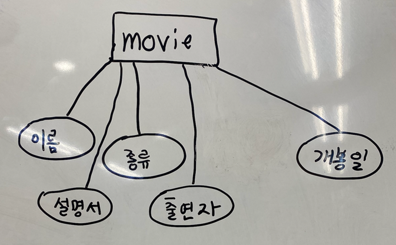
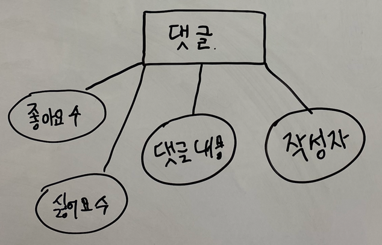
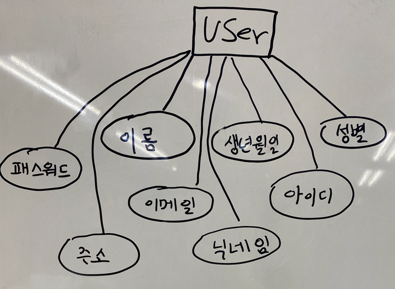
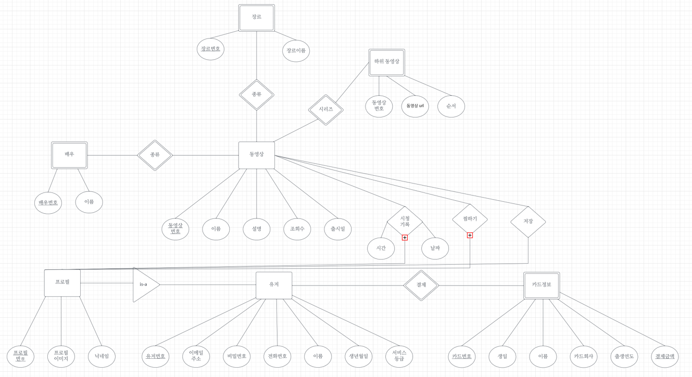
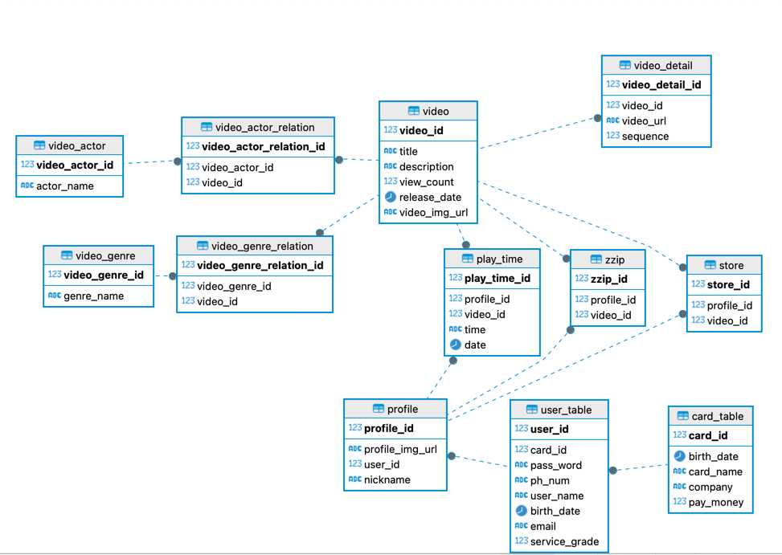

# RDB 
- This Page is about RDB Page.

## 개체
||||
|---|---|---|
|||

# 논리적 모델링

```python

카드정보(카드번호(PK), 생일, 이름, 카드회사, 출생연도, 결제금액)
유저(유저번호(PK), 카드번호(FK), 이메일 주소, 비밀번호, 전화번호, 이름, 생년월일, 서비스 등급,)
프로필(프로필 번호(PK), 유저번호(FK), 프로필 이미지, 닉네임)
동영상(동영상 번호(PK), 이미지 url, 제목, 설명, 조회수, 출시일)
시청기록(시청기록 번호(PK), 프로필 번호(FK), 동영상 번호(FK), 시간, 날짜)
찜하기(찜하기 번호(PK), 프로필번호(FK), 동영상 번호(FK)),
저장(저장 번호(PK), 프로필 번호(FK), 동영상 번호(FK))
배우(배우번호(PK), 이름)
배우동영상(배우동영상번호(PK), 배우번호(FK), 동영상 번호(FK))
장르(장르번호(PK), 장르이름)
장르동영상(장르동영상번호(PK), 장르번호(FK), 동영상번호(FK))
하위동영상(동영상 번호(PK), 동영상 번호(FK), 동영상url, 순서)
```

# 물리적 모델링



## 테이블 관련 SQL
```sql
// 비디오 테이블
create table video(
    video_id int IDENTITY (1, 1) primary key,
    title varchar(20) not null,
    description varchar(255),
    view_count int default 0,
    release_date date not null,
    video_img_url varchar(255) not null
);
// 배우 테이블
create table video_actor(
    video_actor_id int IDENTITY (1, 1) primary key,
    actor_name varchar(10) not null
);
// 배우 비디오 테이블
create table video_actor_relation(
    video_actor_relation_id int IDENTITY (1, 1) primary key,
    video_actor_id int not null,
    video_id int not null,
    foreign key (video_actor_id) references video_actor(video_actor_id),
    foreign key (video_id) references video(video_id)
);
// 장르 테이블
create table video_genre(
    video_genre_id int IDENTITY (1, 1) primary key,
    genre_name varchar(10) not null 
);
// 동영상 장르 테이블
create table video_genre_relation(
    video_genre_relation_id int IDENTITY (1, 1) primary key,
    video_genre_id int not null,
    video_id int not null,
    foreign key (video_genre_id) references video_genre(video_genre_id),
    foreign key (video_id) references video(video_id)
);
// 하위 동영상 테이블
create table video_detail(
    video_detail_id int IDENTITY (1, 1) primary key,
    video_id int not null,
    video_url varchar(255) not null,
    sequence int not null,
    foreign key (video_id) references video(video_id)
    
);

// 카드 테이블
create table card_table(
    card_id varchar(255) primary key,
    birth_date date,
    card_name varchar(20),
    company varchar(20) not null,
    pay_money int not null
);

// 유저 테이블
create table user_table(
    user_id int IDENTITY (1, 1) primary key,
    user_idc VARCHAR(40) not null unique,
    card_id varchar(255) not null,
    pass_word varchar(255) not null,
    ph_num varchar(20) unique,
    user_name varchar(20) not null,
    birth_date date,
    email varchar(40),
    service_grade int not null,
    foreign key (card_id) references card_table(card_id)
);

// 프로필 테이블
create table profile(
    profile_id int IDENTITY (1, 1) primary key,
    profile_img_url varchar(255) not null,
    user_id int not null,
    nickname varchar(255),
    foreign key (user_id) references user_table(user_id)
);

create table zzip(
    zzip_id int IDENTITY (1, 1) primary key,
    profile_id int not null,
    video_id int not null,
    foreign key (profile_id) references profile(profile_id),
    foreign key (video_id) references video(video_id)
);

create table play_time(
    play_time_id int IDENTITY (1, 1) primary key,
    profile_id int not null,
    video_id int not null,
    time varchar(50) not null,
    date date not null,
    foreign key (profile_id) references profile(profile_id),
    foreign key (video_id) references video(video_id)
);

create table store(
    store_id int IDENTITY (1, 1) primary key,
    profile_id int not null,
    video_id int not null,
    foreign key (profile_id) references profile(profile_id),
    foreign key (video_id) references video(video_id)
);
```
