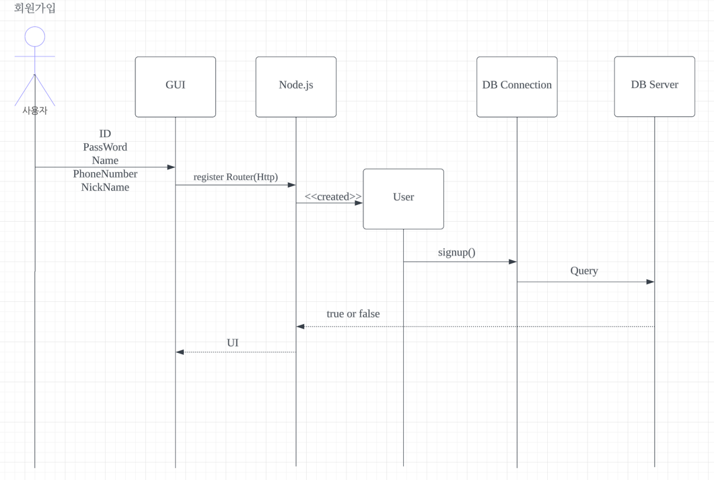

## Usecase에서 도출한 sequence diagram

## Description
This Page is about Sequence diagram Page.

| image                     | Date          | 기능       |
|---------------------------|---------------|----------|
|        | 2023.11.15(수) | 로그인 기능   |
|    | 2023.11.15(수) | 영화 목록 불러오기 |
|    | 2023.11.15(수) | 영화 시청 이어보기 |
|    | 2023.11.15(수) | 로그아웃     |
|    | 2023.11.15(수) | 회원가입     |
|    | 2023.11.15(수) | 비밀번호 변경  |
|    | 2023.11.15(수) | 계정정보 수정  |
|    | 2023.11.15(수) | 계정 삭제    |
|    | 2023.11.15(수) | 계정 조회(관리자) |
|  | 2023.11.15(수) | 계정 조회(사용자) |
|  | 2023.11.15(목) | 영화 상세정보  |
