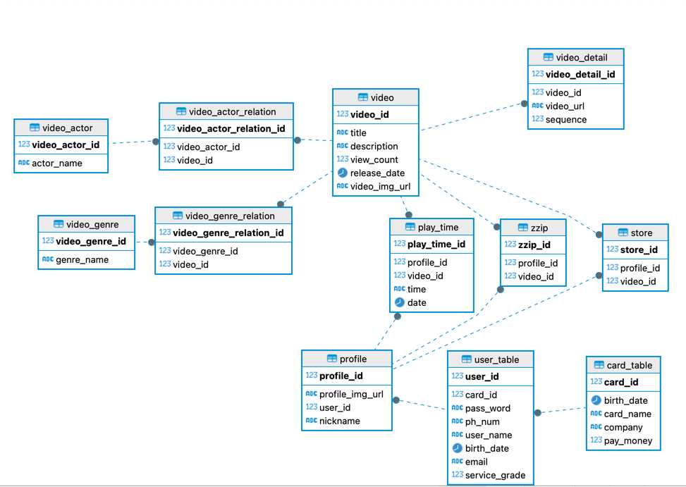

# ERD SQL
- 논리적 모델에 기반해 물리적 모델 만들기

```
[하]
-DDL (CREATE, ALTER, DROP) 中 택1
-DML (INSERT, UPDATE, DELETE) 中 택1
-SELECT 문
1. DISTINCT / * / AS / MAX / MIN / AVG / SUM  -> 中 택1
2. 숫자 컬럼에 대한 산술 연산,
3. 널 값의 비교 (IS NULL, IS NOT NULL) ->  中 택1
4. 숫자 문자 / 날짜의 비교 ->  中 택1
5. 튜플의 개수를 카운트 (COUNT)

[중]
-SELECT 문
1. WHERE 절에서 검색 조건 (비교 연산자, 논리 연산자 사용) ->  中 택1
2. WHERE 절에서 다수의 값 비교 (BETWEEN AND, NOT BETWEEN AND, IN, NOT IN) ->  中 택1
3. 문자 컬럼의 부분 비교
4. 정렬
5. 그룹

[상]
-SELECT 문
1. 조인 연산
2. UNION, INTERSECT, MINUS ->  中 택1
3. 중첩 SQL
```



## 테이블 관련 SQL
```sql
// 비디오 테이블
create table video(
    video_id int IDENTITY (1, 1) primary key,
    title varchar(20) not null,
    description varchar(255),
    view_count int default 0,
    release_date date not null,
    video_img_url varchar(255) not null
);
// 배우 테이블
create table video_actor(
    video_actor_id int IDENTITY (1, 1) primary key,
    actor_name varchar(10) not null
);
// 배우 비디오 테이블
create table video_actor_relation(
    video_actor_relation_id int IDENTITY (1, 1) primary key,
    video_actor_id int not null,
    video_id int not null,
    foreign key (video_actor_id) references video_actor(video_actor_id),
    foreign key (video_id) references video(video_id)
);
// 장르 테이블
create table video_genre(
    video_genre_id int IDENTITY (1, 1) primary key,
    genre_name varchar(10) not null 
);
// 동영상 장르 테이블
create table video_genre_relation(
    video_genre_relation_id int IDENTITY (1, 1) primary key,
    video_genre_id int not null,
    video_id int not null,
    foreign key (video_genre_id) references video_genre(video_genre_id),
    foreign key (video_id) references video(video_id)
);
// 하위 동영상 테이블
create table video_detail(
    video_detail_id int IDENTITY (1, 1) primary key,
    video_id int not null,
    video_url varchar(255) not null,
    sequence int not null,
    foreign key (video_id) references video(video_id)
    
);

// 카드 테이블
create table card_table(
    card_id varchar(255) primary key,
    birth_date date,
    card_name varchar(20),
    company varchar(20) not null,
    pay_money int not null
);

// 유저 테이블
create table user_table(
    user_id int IDENTITY (1, 1) primary key,
    user_idc VARCHAR(40) not null unique,
    card_id varchar(255) not null,
    pass_word varchar(255) not null,
    ph_num varchar(20) unique,
    user_name varchar(20) not null,
    birth_date date,
    email varchar(40),
    service_grade int not null,
    foreign key (card_id) references card_table(card_id)
);

// 프로필 테이블
create table profile(
    profile_id int IDENTITY (1, 1) primary key,
    profile_img_url varchar(255) not null,
    user_id int not null,
    nickname varchar(255),
    foreign key (user_id) references user_table(user_id)
);

create table zzip(
    zzip_id int IDENTITY (1, 1) primary key,
    profile_id int not null,
    video_id int not null,
    foreign key (profile_id) references profile(profile_id),
    foreign key (video_id) references video(video_id)
);

create table play_time(
    play_time_id int IDENTITY (1, 1) primary key,
    profile_id int not null,
    video_id int not null,
    time varchar(50) not null,
    date date not null,
    foreign key (profile_id) references profile(profile_id),
    foreign key (video_id) references video(video_id)
);

create table store(
    store_id int IDENTITY (1, 1) primary key,
    profile_id int not null,
    video_id int not null,
    foreign key (profile_id) references profile(profile_id),
    foreign key (video_id) references video(video_id)
);
```


## 조회 관련 SQL

| 질문                                | sql문                                                                                               |
|-----------------------------------|----------------------------------------------------------------------------------------------------|
| 1. 유저의 아이디를 불러오는 sql문             | select user_id from user_table                                                                     |
| 2. 유저의 비밀번호를 불러오는 sql문            | select pass_word from user_table where user_id = ?                                                 |
| 3. 유저의 프로필을 불러오는 sql문             | select profile_img_url, nickname from profile p, user_table u where u.user_id = p.user_id and user_id = ? |
| 4. 유저의 시청기록을 불러오는 sql문            | select time, date from play_time where profile_id = ?                                              |
| 5. 장르에 해당하는 비디오를 불러오는 sql문        |                                                                                                    |
| 6. 배우에 해당하는 비디오를 불러오는 sql문        |                                                                                                    |
| 7. 해당하는 유저의 찜목록을 불러오는 sql문        |                                                                                                    |
| 8. 해당하는 유저의 저장 목록을 불러오는 sql문      |                                                                                                    |
| 9. 유저의 카드 정보를 불러오는 sql문           |                                                                                                    |
| 10. 비디오에 해당하는 배우 정보를 불러오는 sql문    |                                                                                                    |
| 11. 비디오에 해당하는 장르를 불러오는 sql문       |                                                                                                    |
| 12. 비디오의 시리즈를 불러오는 sql문           |                                                                                                    |
| 13. 사용자의 시청기록에 따라서 비디오를 불러오는 sql문 |                                                                                                    |
|                                   |                                                                                                    |
|                                   |                                                                                                    |
|                                   |                                                                                                    |
|                                   |                                                                                                    |
|                                   |                                                                                                    |
|                                   |                                                                                                    |
|                                   |                                                                                                    |
|                                   |                                                                                                    |
|                                   |                                                                                                    |
|                                   |                                                                                                    |

## 예제 데이터 입력 쿼리

| 질문                     | sql 문                                                                                                                                                           |
|------------------------|-----------------------------------------------------------------------------------------------------------------------------------------------------------------|
| 1. 비디오 업로드 후 데이터베이스에 비디오 등록 | insert into video(title, description, view_count, release_date, video_img_url) values ();<br/>insert into video_detail(video_id, video_url, sequence) values(); |
| 2. 사용자 데이터 입력하기        | insert into user_table(pass_word, ph_num, card_id, ph_num, user_name, birth_date, email, service_grade) values();                                               |
| 3. 프로필 만들기             | insert into profile(user_id, profile_img_url, nickname) values();                                                                                               |
| 4. 장르 추가하기             | insert into video_genre(genre_name) values();                                                                                                                   |
| 5. 배우 추가하기             | insert into video_actor(actor_name) values();                                                                                                                   |
| 6. 비디오 배우 관계 추가하기      | insert into video_actor_relation(video_actor_id, video_id) values();                                                                                            |
| 7. 비디오 장르 관계 추가하기      | insert into video_genre_relation(video_genre_id, video_id) values();                                                                                            |
| 8. 찜하기                 | insert into zzip(profile_id, video_id) values();                                                                                                                |
| 9. 저장하기                | insert into store(profile_id, video_id) values();                                                                                                               |
| 10. 시청시간 기록            | insert into play_time(profile_id, video_id, time, date) values();                                                                                               |
|                        |                                                                                                                                                                 |


## 예제 데이터 삭제 쿼리

| 질문          | sql 문                                    |
|-------------|------------------------------------------|
| 1. 프로필 삭제하기 | delete from profile where profile_id = ? |
| 2. 유저 삭제하기  | delete from user_table where user_id = ? |
| 3. 비디오 삭제하기 | delete from video where video_id = ?     |

```sql

```