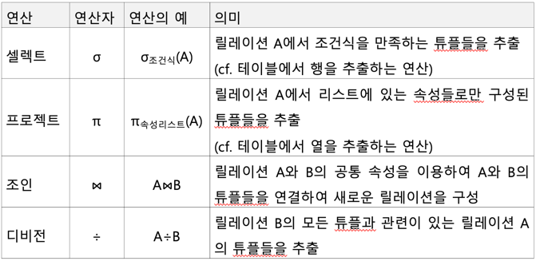

# 관계 대수란?
- 관계형 모델을 적용한 데이터베이스에서는 사용자에게 데이터가 테이블 형태로 저장된 것 처럼 보인다.
- 관계 대수란?
  - 테이블 형태의 릴레이션으로부터 필요한 정보를 추출할 수 있는 연산들을 이론적으로 정리

## 관계 대수 연산자

- 일반 집합 연산자 
  - 합집합
  - 교집합
  - 차집합
  - 카티션 프로덕트 (X) 말그대로 곱하기 개념
- 순수 관계 연산자
  - 셀렉트
  - 프로젝트
  - 조인
  - 디비전

