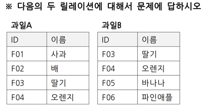
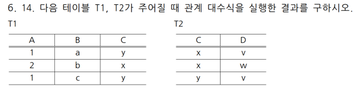
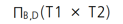
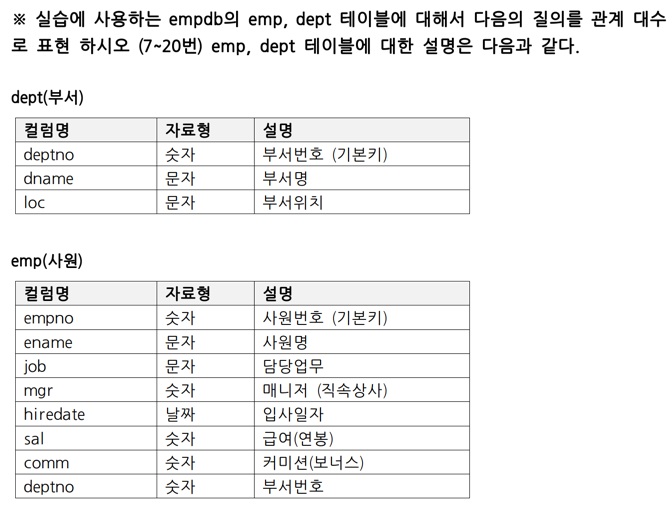
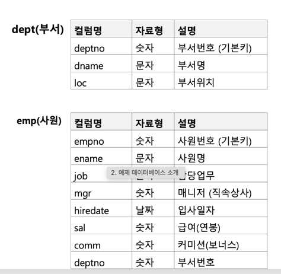
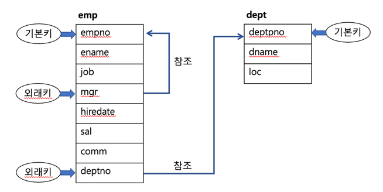
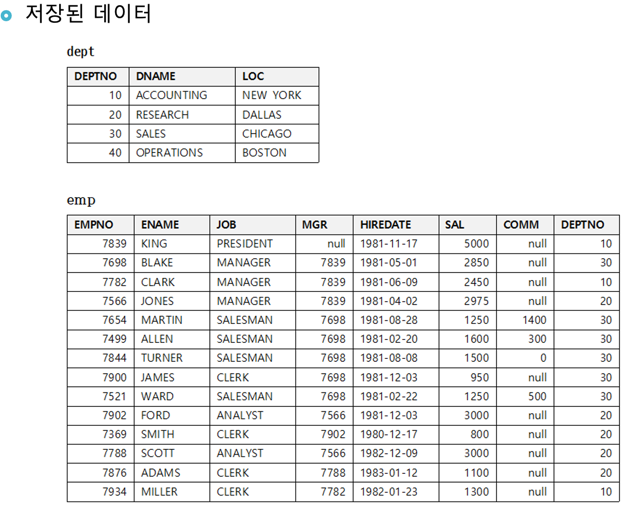
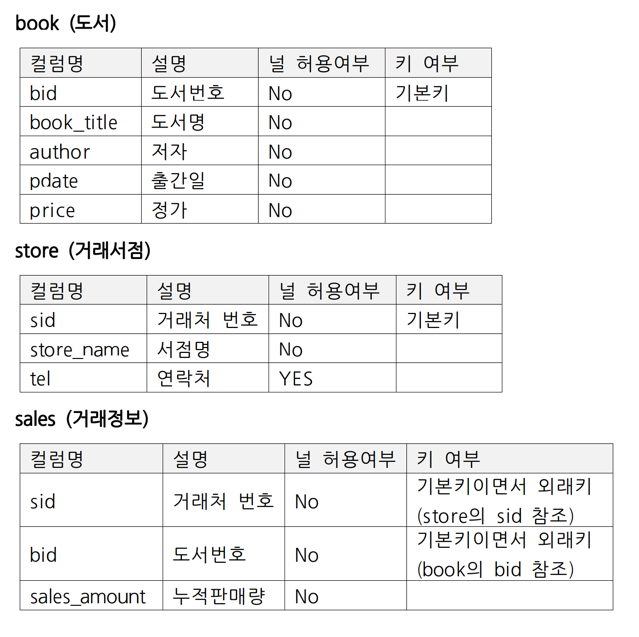
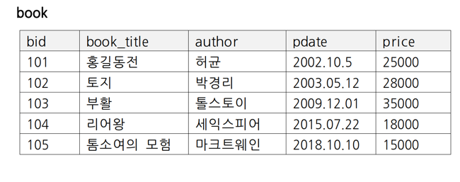
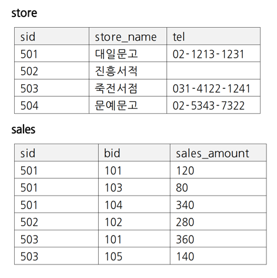

# 모든 문제 정리

# 관계대수 문제

| 문제                                                                                           | 답안 |
|----------------------------------------------------------------------------------------------|----|
| 관계 대수의 일반 집합 연산자 4개를 제시하시오.                                                                  |    |
| 관계 대수의 순수 관계 연산자 4개를 제시하시오.                                                                  ||
| <br/>두 릴레이션의 합집합을 보이시오.                                             ||
| <br/>두 릴레이션의 교집합을 보이시오.                                             ||
| <br/>두 릴레이션의 차집합 과일A-과일B를 보이시오.                                     ||
|                                            ||
| <br/>BOSTON에 있는 부서의 이름은 무엇인가?                                       ||
| 담당 업무가 ANALYST인 사원의 이름, 입사 일자를 보이시오.                                                         ||
| 부서번호가 10인 사원의 이름과 입사일자를 보이시오.                                                                ||
| 연봉이 3000에서 4000사이인 사원의 이름, 연봉을 보이시오.                                                         ||
| 사장의 이름을 보이시오 (힌트: 사장의 담당업무는 PRESIDENT이다.)                                                    ||
| 담당업무가 MANAGER가 아닌 사원들의 이름, 담당업무를 보이시오.                                                       ||
| 연봉이 3000에서 4000사이 이거나 담당업무가 MANAGER인 사원의 이름, 연봉을 보이시오.                                       ||
| 부서번호가 20인 사원 중에서 담당업무가 CLERK이고, 매니저의 사원번호가 7902인 사원의 이름을 보이시오.                               ||
| DALLAS에서 근무하는 사원의 이름, 부서명, 담당업무를 보이시오.                                                       ||
| DALLAS에서 근무하는 사원중 연봉이 4000 이하인 사원의 이름을 보이시오.                                                 ||
| PRESIDENT (사장)이 근무하는 지역은 어디인가?                                                               ||
| SALES 부서에서 일하는 사원의 이름, 담당업무를 보이시오.                                                           ||
| RESEARCH부서에서 일하는 사원의 이름, 급여, 입사일자를 보이시오.                                                     ||
| ACCOUNTING 부서에 일하는 사원중 급여가 2000이상인 사원의 이름, 담당업무를 보이시오.                                       ||
| <br/>남학생의 이름과 성별, 학년을 검색하시오.<br/>'데이터베이스'를 수강하는 학생들의 학번과 이름을 검색하시오. ||




| 문제                                                                                                           | 답안 |
|--------------------------------------------------------------------------------------------------------------|----|
| BOSTOM에 있는 부서의 이름은 무엇인가?                                                                                     |    |
| 담당 업무가 ANALYST인 사원의 이름, 입사 일자를 보이시오.                                                                         |    |
| 부서번호가 10인 사원의 이름과 입사일자를 보이시오.                                                                                |    |
| 매니저인 사원의 사원번호를 중복을 제거하고 보이시오.                                                                                |    |
| 담당업무가 ANALYST인 사원들의 모든 정보를 보이시오.                                                                             |    |
| 연봉이 3000에서 4000사이인 사원의 이름, 연봉을 보이시오.                                                                         |    |
| 입사일자가 1981년 1월 ~ 6월이 아닌 사원의 이름, 입사일자를 보이시오.                                                                  |    |
| 소속 부서 번호가 10 또는 20인 사원의 사원번호, 이름, 부서번호를 보이시오.                                                                |    |
| 사장의 이름을 보이시오. (힌트: 사장의 담당업무는 : PRESIDENT이다)                                                                  |    |
| 담당업무가 CLERK가 아닌 사원들의 이름, 담당업무를 보이시오.                                                                         |    |
| 연봉이 3000에서 4000사이이거나 담당업무가 CLERK인 사원의 이름, 연봉을 보이시오.                                                          |    |
| 부서번호가 20인 사원 중에서 담당업무가 CLERK이고 매니저의 사원번호가 7902인 사원의 이름을 보이시오.                                                |    |
| 담당 업무가 ANALYST, CLERK, MANAGER 중의 하나인 사원의 이름, 담당업무, 급여를 보이시오(단 IN 또는 NOT IN을 사용하시오)                          |    |
| 담당 업무가 ANALYST, MANAGER, SALESMAN 중의 하나가 아닌 사원의 이름, 담당업무, 급여를 보이시오 (단 IN 또는 NOT IN을 사용하시오.)                  |    |
| 담당 업무명에 'NA'를 포함하는 사원의 이름, 담당업무를 보이시오.                                                                       |    |
| 담당 업무명의 두 번째 글자가 'A'인 사원의 이름, 담당업무를 보이시오.                                                                    |    |
| 20번 부서에 근무하는 사원들의 평균 급여액을 보이시오.                                                                              |    |
| 10번 부서에 근무하는 사원중 급여를 가장 많이 받는 사원의 급여를 보이시오.                                                                  |    |
| 담당업무가 MANAGER인 사원들중 급여를 가장 많이 받는 사원과 가장 적게 받는 사원의 급여액 차이를 보이시오.                                              |    |
| 담당업뭄가 SALESMAN이거나 30번 부서에 근무하는 사원의 급여액 합계를 보이시오.                                                             ||
| 사원들에게 지급되는 보너스(comm)의 합계를 보이시오.                                                                              ||
| 입사일이 1981년 9월 1일 이후인 사원의 평균 연봉을 보이시오.                                                                        ||
| 모든 사원들의 현재 급여액 합계와 급여를 20% 올렸을 때 급여액 합계를 보이시오.                                                               ||
| 담당 업무가 SALESMAN인 사원들의 급여를 20% 인상하기 위해서는 현재보다 얼마의 비용이 더필요한가를 보이시오.                                            ||
| 모든 담당업무명을 알파벳순으로 보이시오.                                                                                       ||
| 모든 사원의 이름과 업무, 급여를 급여액 내림차순으로 보이시오.                                                                          ||
| 담당 업무가 SALESMAN인 사원의 이름과 부서번호를 입사일자순으로 보이시오.                                                                 ||
| 급여가 1500 이상이고 담당업무가 MANAGER인 사원의 사원번호, 이름, 급여를 이름 알파벳순으로 보이시오.                                               ||
| 담당업무별 평균연봉을 보이시오.                                                                                            ||
| 부서별 평균 연봉을 보이되 많은연봉 우선으로 보이시오.                                                                               ||
| 각 부서별 최고 연봉을 보이시오.                                                                                           ||
| 모든 사원의 정보를 담당업무에 대해 오름차순으로, 그리고 같은 업무내에서는 연봉내림차순으로 정렬하여보이시오.                                                 ||
| 각 매니저별 담당사원의 인원수, 평균 연봉을 보이시오. (매니저 NULL인 경우는 제외하시오)                                                         ||
| 각 담당 업무별로 최고 연봉과 최저 연봉을 보이시오.                                                                                ||
| 담당업무별 인원수, 평균 연봉을 보이되 업무별 인원수가 3명 이상인 경우에 대해서만 보이시오.                                                         ||
| 각 부서별 부서번호, 사원 수, 연봉합계를 보이시오.                                                                                ||
| 각 부서별 부서번호, 사원 수, 연봉합계를 보이되 사원 수가 5명 이상인 부서의 정보만 보이시오.                                                       ||
| 부서번호, 부서별 사원 수, 연봉 합계를 보이되 급여합계가 9000~10000사이인 경우만 보이시오. 단 입사일자가 1981-01-01 이전 사원은 제외하고, 연봉합계가 많은 순으로 출력하시오. ||
|                                                                                                              ||
|                                                                                                              ||
|                                                                                                              ||
|                                                                                                              ||
|                                                                                                              ||
|                                                                                                              ||

# SELECT 문제
- 테이블에 대한 정보는 다음과 같다.





# 조인, UNION, INTERSECT, MINUS 에 관한 문제

| 문제                                                                                                      |   |
|---------------------------------------------------------------------------------------------------------|---|
| DALLAS에서 근무하는 사원의 이름, 부서명, 담당업무를 보이시오.                                                                  |   |
| DALLAS에서 근무하는 사원 중 연봉이 4000이하인 사원의 이름을 보이시오.                                                            |   |
| PRESIDENT(사장)이 근무하는 지역은 어디인가?                                                                           ||
| SALES 부서에서 일하는 사원의 이름, 담당업무를 보이시오.                                                                      ||
| RESESRCH 부서에서 일하고, 입사일자가 1981-05-01 이후인 사원의 이름, 급여, 입사일자를 보이시오.                                         ||
| ACCOUNTING 부서에 일하는 사원 중 급여가 2000이상인 사원의 이름, 담당업무, 급여를 보이시오.                                             ||
| 각 지역별로 근무하는 사원들의 연봉 합계를 보이시오.(지역명, 연봉합계)                                                                ||
| 달라스(DALLAS)에서 일하는 사원 중 급여를 가장 많이 받는 사원과 가장 적게 받는 사원의 급여액 차이를 보이시오.                                      ||
| 모든 매니저의 이름과 부하직원의 이름을 보이시오(매니저이름으로 정렬하여 보이시오)                                                           ||
| 모든 매니저의 이름과 부하직원의 숫자를 보이시오.                                                                             ||
| 모든 매니저의 이름과 부하직원의 연봉합계, 매니저의 부서위치를 보이시오.                                                                ||
| 담당 업무가 CLERK인 사원의 매니저의 이름 사원의 이름, 사원의 급여를 보이시되, 매니저 이름으로 정렬하여 보이시오.                                     ||
| 자신의 매니저보다 급여를 더 많이 받는 사원이 있다면, 이름과 급여를 보이시오.                                                            ||
| 10번 부서와 20번 부서의 사원이름, 입사일자, 부서번호를 보이되 UNION 이용하여 문제를 해결 하시오.                                            ||
| 담당업무가 CLERK이고, 급여를 1000이상 받는 사원의 이름, 급여를 보이되 INTERSECT를 이용하여 문제를 해결하시오.                                 ||
| 급여를 1000이상 받는 사원중에서 담당업무가 MANAGER이거나 PRESIDENT인 사원은 제외하고 사원의 이름, 담당업무 급여를 보이시오. 단 MINUS를 이용해 문제를 해결하시오. ||
| 연봉을 가장 적게 받는 사원의 이름, 연봉, 부서명을 보이시오.                                                                     ||
| 연봉을 평균 이상 받는 사원들의 이름, 연봉, 근무지를 보이시오.                                                                    ||
| 연봉을 가장 적게 받는 사원의 매니저의 이름을 보이시오.                                                                         ||
| 연봉을 가장 많이 받는 사원과 적게 받는 사원의 이름, 연봉을 보이시오.                                                                ||
| 연봉을 가장 많이 받는 사원과 적게 받는 사원을 제외한 나머지 사원들의 총 연봉 합계를 보이시오.                                                  ||
| SALES 부서에 속한 사원들과 동일한 담당업무를 갖는 사원들의 이름, 담당업무를 보이시오(단 SALED 부서에 속한 사원은 제외)                               ||
| 연봉을 평균보다 500이상 적게 받는 사원들의 이름, 부서명, 연봉을 보이시오.                                                            ||


# 데이터 정의어 문제

- 테이블의 정보는 다음과 같다.




| 문제                                                                                                         |                                                                      |
|------------------------------------------------------------------------------------------------------------|----------------------------------------------------------------------|
| 다음은 어느 출판사의 도서관리 테이블과 거래서점 테이블이다. empdb에 다음과 같은 구조의 테이블들을 SQL을 사용하여 생성하시오. 컬럼의 자료형은 컬럼에 저장될 값을 고려하여 판단하시오. |                                                                      |
| 1번에서 생성한 테이블들에 대해 SQL문으로 다음과 같이 데이터를 입력하시오.                                                                |                                                                      |
| 죽전서점의 전화번호를 031-4142-5763으로 변경하는 SQL문을 작성하시오.                                                              | ``` update store set tel='031-4142-5763' where store_name='죽전서점' ``` |
| 2010년 이전의 책들은 가격을 3000원씩 인하하여 저장하는 SQL문을 작성하시오.                                                            |                                                                      |
| 문예문고를 거래처 테이블에서 삭제하는 SQL문을 작성하시오.                                                                          |                                                                      |
| 도서 테이블에 페이지수(pages) 컬럼을 추가하는 SQL문을 작성하시오. 자료형은 int로 하고 널값을 허용한다.                                           | alter table book add pages int                                       |
| book, store, sales 테이블을 삭제하는 SQL문을 작성하시오.                                                                  | drop table book, store, sales;                                       |
